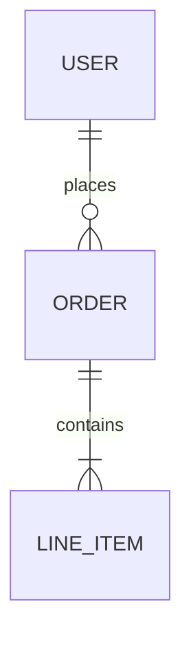

<!-- generated-by: groundrules v1.10.0 -->
# Data Model — mcp-freestyle

**Living** description of the data model. Update it whenever the schema changes.

For the **why** behind choices (engine, denormalization...) → see `docs/decisions/`.

> **Storage is nothing.** V1 is pass-through — readings are fetched, normalized, returned,
> and forgotten. The entities below describe the in-memory shape, not a schema. Persistence
> arrives only with Milestone 4, if at all ([ADR 0003](decisions/0003-nightscout-as-alternate-source.md)
> hands that job to Nightscout).

## Overview

Paragraph or diagram: the main entities and their relationships.

<!-- Mermaid example:

-->

## Entities

### Reading

| Field | Type | Constraints | Description |
|---|---|---|---|
| `id` | `string` | PK | Identifier (source id, or derived from timestamp) |
| `mgPerDl` | `number` | required | Canonical value. See "Units" below — we store one unit, not a value+unit pair |
| `measured_at` | `timestamp` | required, **UTC** | Instant of measurement; render local, store UTC |
| `trend` | `enum` | nullable | Only present on the *current* reading; always null for history |
| `source` | `string` | required | Where it came from (device / service / import) |

#### Units — resolved by the upstream payload

The upstream always supplies **`ValueInMgPerDl`**, a field whose unit is in its own name,
alongside the display-preference pair `Value` + `GlucoseUnits` (`1` = mg/dL). The account's
`alarmRules` confirm the convention by carrying both scales (`th: 250` / `thmm: 13.9`;
250 ÷ 18.0182 = 13.87 ✓).

So the unit-confusion risk is designed away rather than defended against: **store
`ValueInMgPerDl` as the single canonical value, and treat the user's unit as a rendering
concern at the output edge only.** Never persist a bare number whose unit lives elsewhere.

#### Timestamps — which field is authoritative

Each upstream reading carries two unmarked strings in `M/D/YYYY h:mm:ss AM/PM`:

- **`FactoryTimestamp` — UTC. This is the source of truth.**
- `Timestamp` — already converted to the account's local zone.

Parse `FactoryTimestamp` explicitly as UTC. Never `new Date(str)`, and never derive the zone
from the delta between the two fields — that delta is the current DST offset (observed 2 h in
August, it will be 1 h in winter) and encodes nothing durable.

#### Target range comes from upstream

`targetLow` / `targetHigh` (mg/dL) are supplied per account — 70/180 observed. Time-in-range
does not need a user-configured band; read the account's own.

### Sensor session

| Field | Type | Constraints | Description |
|---|---|---|---|
| `id` | `string` | PK | Identifier |
| `started_at` | `timestamp` | UTC | Sensor activation |
| `ended_at` | `timestamp` | UTC, nullable | Null while active |
| `serial` | `string` | **sensitive** | Never logged, never committed |

## Relationships

- `Sensor session` 1—N `Reading`: readings belong to the session active at `measured_at`.

## Access rules / row-level security

> V1 is single-user and local (see `docs/VISION.md` non-goals) — there is no row-level
> access model. Access control is filesystem-level. Revisit this section if multi-user
> ever leaves the non-goals list.

## Indexes and performance

- `Reading(measured_at)` — every history query is a time-range scan; this is the one index
  that matters.

## Migrations

Not applicable — there is no store to migrate. This section exists only so the absence is
explicit rather than an oversight.

## Gaps are data

A missing interval (sensor warm-up, disconnection, out-of-range) is **not** a zero and not an
interpolation. Model it as absence and surface it to the agent as such — an aggregate
computed over an unacknowledged gap is wrong.
