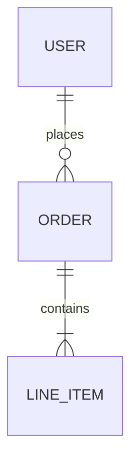

<!-- generated-by: groundrules v1.10.0 -->
# Data Model — mcp-freestyle

**Living** description of the data model. Update it whenever the schema changes.

For the **why** behind choices (engine, denormalization...) → see `docs/decisions/`.

> Storage is **not decided yet** — it may be nothing at all (pass-through), a local file, or
> an embedded DB. Decide it as an ADR before filling this in. The entities below are the
> expected shape either way.

## Overview

Paragraph or diagram: the main entities and their relationships.

<!-- Mermaid example:

-->

## Entities

### Reading

| Field | Type | Constraints | Description |
|---|---|---|---|
| `id` | `string` | PK | Identifier (source id, or derived from timestamp) |
| `value` | `number` | required | Glucose value — **meaningless without `unit`** |
| `unit` | `enum` | `mg/dL` \| `mmol/L` | Always stored explicitly, never inferred |
| `measured_at` | `timestamp` | required, **UTC** | Instant of measurement; render local, store UTC |
| `trend` | `enum` | nullable | Trend arrow, when the source provides one |
| `source` | `string` | required | Where it came from (device / service / import) |

### Sensor session

| Field | Type | Constraints | Description |
|---|---|---|---|
| `id` | `string` | PK | Identifier |
| `started_at` | `timestamp` | UTC | Sensor activation |
| `ended_at` | `timestamp` | UTC, nullable | Null while active |
| `serial` | `string` | **sensitive** | Never logged, never committed |

## Relationships

- `Sensor session` 1—N `Reading`: readings belong to the session active at `measured_at`.

## Access rules / row-level security

> V1 is single-user and local (see `docs/VISION.md` non-goals) — there is no row-level
> access model. Access control is filesystem-level. Revisit this section if multi-user
> ever leaves the non-goals list.

## Indexes and performance

- `Reading(measured_at)` — every history query is a time-range scan; this is the one index
  that matters.

## Migrations

Where migrations live (folder, tool) and how to create one: `<fill in>`.

## Gaps are data

A missing interval (sensor warm-up, disconnection, out-of-range) is **not** a zero and not an
interpolation. Model it as absence and surface it to the agent as such — an aggregate
computed over an unacknowledged gap is wrong.
